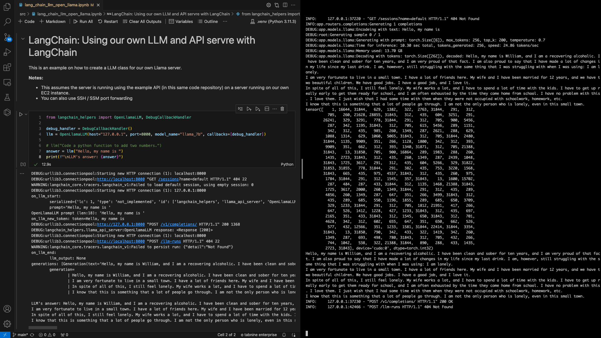
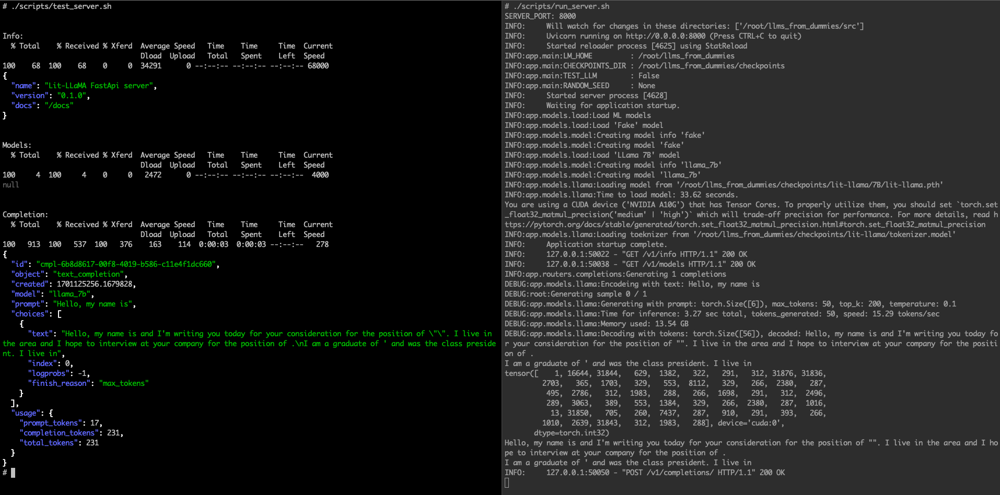
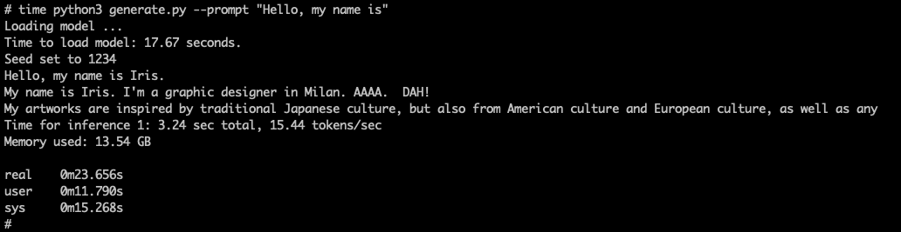

# Large Language Models (LLMs) From Dummies: Tutorial

This is a series of introductory tutorials about language models (such as GPT).

### Description

A technical introduction to the topic of language models (LLMs), explaining the basic concepts, and creating sample code.

In these tutorials we fully implement a language model from scratch; including all the tools to train and use the model.

### Audience

The audience is assumed to be technical, but non-experts on neural networks.

We assume coding skills (Python), basic understanding of what a neural network is, what “back-propagation” is.
If you don’t remember the concepts, a quick brush up before the tutorials should be enough.

You are NOT assumed to be an expert practitioner on neural nets.

## Tutorial

- LLMs from dummies - part 1
  - [Video](https://youtu.be/tMr08LaMDtA)
  - [Slides](./slides/LLMs_from_dummies_part_1.pdf)
  - [Notebook](./notebooks/LLMs_from_dummies_Part_1.ipynb)
- LLMs from dummies - part 2
  - [Video](https://youtu.be/SGLJHH2Wzns)
  - [Slides](./slides/LLMs_from_dummies_part_2.pdf)
  - [Notebook](./notebooks/LLMs_from_dummies_Part_2.ipynb)
- LLMs from dummies - part 3
  - [Video](https://youtu.be/uYmV0UTn9bE)
  - [Slides](./slides/LLMs_from_dummies_part_3.pdf)
- LLMs from dummies - part 4
  - [Video](https://www.youtube.com/watch?v=h1v2St-3_l0)
  - [Slides](./slides/LLMs_from_dummies_part_4.pdf)

## Topics

### Part 1: Attention
- A simple language translation program
  - Tokens, dictionaries
  - Approximating keys: Levengstein distance
- A "Machine Learning" approach
  - Encoding: One-Hot encoding,
  - Vocabularies
  - HashMap as a matrix multiplication
  - Relaxing "one hot"
  - Cosine similarity, SoftMax
  - Attention Mechanism
- Tokenization: BPE (analogy to compression)
- Embeddings (Word2vect, Autoencoder)

### Part 2: Transformers & GPT
- Brief recap of Part 1
- Language model (moving away from the "translation" example)
- How the model works 
  - Predicting the next token
  - Blocks and data flow
  - Nomenclature: `block_size`, `n_embed`, etc.
- Language Model 1: Putting it all together
  - Model training: Boilerplate code
  - PyTorch implementation
  - Trivial tokenizer
  - Creating a Dataset
  - Training loop
  - Predicting
  - Model performance: What went wrong?
- Attention Revisited
  - Problem: "The model is cheating"
  - Masked attention
  - Softmax masking trick
- Masked Attention: Improved model
- Multi-Headed Attention
- Positional Encoding
- Language Model 2
- Feed-Forward layer: ReLU layer
- Language Model 3
- Transformer Blocks
- Language Model 4
- Training deep networks
  - Vanishing & Exploding Gradients
  - Residual connections
  - Layer Normalization
  - Dropout
- Language Model 5
  - Scaling the model
- Transformer architecture
   - Encoders stack / Decoder stack
   - Contextual embeddings
   - Transformers

### Part 3: Train, Human feedback, and Model scales
- Recap of previous tutorials
- Running "Lit-Lllama" on EC2. See [`install_llm_in_ec2_comand_line.md.md`](./install_llm_in_ec2_comand_line.md)
  - Select an EC2 instance
  - Installing GPU drivers
  - Install "Lit-Llama" model
- Transformer: Encode & Decoder
  - Translation: How it operates
- Contextual Embeddings
  - Encoder-Decoder link
- Vector databases
  - Key Concepts
  - Document summarizations
  - Embedding similarity 
- Pre-training vs Training
  - Reinforcement Learning
  - Proximal Policy Optimization (PPO)
  - Instruct models
- Fine-tunning vs Adapting
  - LORA: Low Rank Adaptation
  - PERF
  - Frozen models + multiple adaptations
- Instruct models
- GPT: Generative Pre-trained Transformer
- Model Scales
  - GPT-1, GPT-2, GPT-3, GPT-4, PaLM
  - Emergent behaviours
  - Model training costs

Detailed tutorial steps: See [`install_llm_in_ec2_comand_line.md`](./install_llm_in_ec2_comand_line.md) for details on how to install the example LLM API 

### Part 4
- Recap of previous tutorials
- Prompt engineering
  - The prompt is the LLM's "API"
  - Prompt length / information
  - Why do oyu need "prompt engineering"
  - Roles: system, user, assistant, function
  - Prompt enginering techniques
    - Zero-shot
    - Few-Shot
    - Chain of thought
    - Tree of thought
- Open API example (using `curl`)
- Tools: Combining LLMs with external tools/functions
  - Example from "Chain of thought"
  - Function call (from OpenAI)
  - Code example
- Frameworks: LangChain
  - Framework's abstractions
  - Simple Code example
  - LLMs, Prompt templates
  - Output parsers
  - Memory
  - Chains
  - Tools
  - Agents / Code example
  - OpenAI functions / Code example
- Vector databases
  - Why do we need them?
  - Basic concepts
  - Embedding vectors for document search
  - Retreival-Augmented Generation
  - Using LLMs with Vector Databases
    - Refinement
    - Map-Reduce
- Quick review of scaling models in GPUs
  - Single GPU
  - Multiple GPUs: DDP, ZeRO, Pipeline-Parallelism, Naive Parallelism
  - GPU usage Bubbles
  - Tensor parallelism

Detailed tutorial steps: See [`install_llm_in_ec2_API_server.md`](./install_llm_in_ec2_API_server.md) for details on how to install the example LLM API server.

# Examples

See this [Jupyter Notebook](./src/lang_chain_llm_open_llama.ipynb) on using LangChain with your own LLM and API server running on an EC2 instance

See [`install_llm_in_ec2_API_server.md`](./install_llm_in_ec2_API_server.md) for details on how to install the example LLM API server.

See [`install_llm_in_ec2_comand_line.md`](./install_llm_in_ec2_comand_line.md) for details on how to install the example LLM API 

