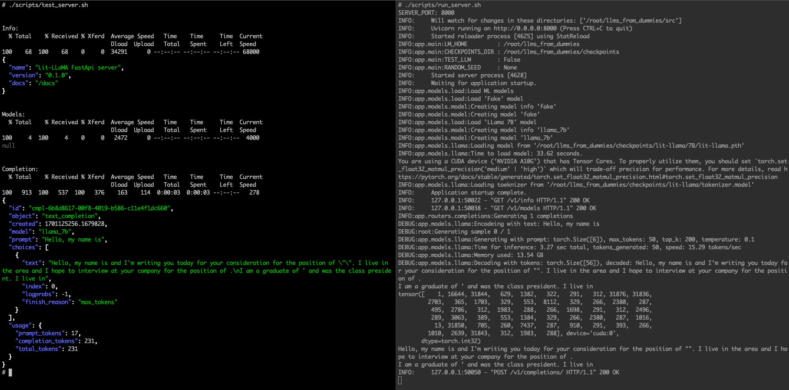

# Install LLM in an EC2 instance (API Server)

### Description

There are examples for a simple implementation of an LLM, an API server, and using LangChain with this server:

1. Running an LLM on EC2: Example of installing a LLama model on an EC2 instance and using it via command line. See details in [`install_llm_in_ec2.md`](./install_llm_in_ec2.md)
2. LLM API Server: Example of creating an API server (FastAPI) that loads an LLM (the one in the previous example) and serves queries via a very simple API.
3. LangChain: Example of connecting LangChain to the API server created in the previous step.

### Install EC2

Follow the steps described in `install_llm_in_ec2_comand_line.md`, section [EC2 instance setup](./install_llm_in_ec2_comand_line.md#ec2-instance-setup)

Note: No need to install `Lit-LLama`, because we do this here

### Install API Server example

```bash
# Clone repository
cd
git clone https://github.com/pcingola/llms_from_dummies.git

# Create virtual environment
# Note: You need to install Python's "venv" by runnign something like
apt install -y python3.10-venv
cd llms_from_dummies/
python3 -m venv .venv

# Activate virtual environment
source .venv/bin/activate

# Install dependencies
pip install -r requirements.txt

# Initialize git-lfs
# Note: You need to install git-lfs
apt install -y git-lfs
git-lfs install
# Download weights from HuggingFace (takes ~5 minutes)
git clone https://huggingface.co/openlm-research/open_llama_7b checkpoints/open-llama/7B

# Convert weights (takes ~2 minutes)
time python3 \
    lit-llama/scripts/convert_hf_checkpoint.py \
    --checkpoint_dir checkpoints/open-llama/7B/ \
    --model_size 7B
```

## Run API server

This server loads a 'lit-llama' model and serves queries via a simple API (FastAPI server implementation)
```
# Run server
./scripts/run_server.sh
```

**WARNING::** If `TEST_LLM` in `scripts/config.sh` is set to 'True', the API server will only load a "fake" LLM (this is used for debugging)

### Test API queries

The script `./scripts/test_server.sh` runs a few simple queries against the API server and displays the JSON results (you need `jq` installed).

This is what it looks like (runing the test and server in two terminals):



### Configuration

The configuration directories are in `scripts/config.sh`, please change the directories appropriately

- `LM_HOME`: This is supposed to be installed in `$HOME/llms_from_dummies`. You need to change this value if you are installing in another directory.
- `VENV_DIR`: We assume that a Python virtual environment is installed in the `$LM_HOME/.venv` directory
- `TEST_LLM`: If this variable is set to 'True', the API server will only load a "fake" LLM. This is usefull when debugging the API server (it is much faster than loading the LLama model)
- `SERVER`, `SERVER_PORT`: Server's IP address and port


