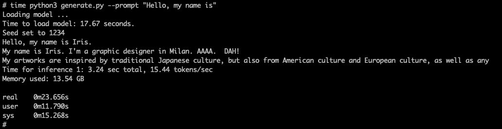

# Install LLM in an EC2 instance (Command line)

## Instance types

Some examples of Single GPU instances (as of July 2023)

| Instance type | GPU  | GPUs  | GPU Ram (GB) |
|---------------|------|-------|--------------|
| p3.2xlarge    | V100 |   1   |              |
| g5.2xlarge    | A10G |   1   |     24       | <-- Choice for 7b model
| g4dn.2xlarge  | T4   |   1   |     16       |
| g5dn.2xlarge  | T4G  |   1   |     16       |

Some examples of Multiple GPU instances (as of July 2023)

| Instance type | GPU  | GPUs  | vCPUs | Ram  | GPU Ram (GB) |
|---------------|------|-------|-------|------|--------------|
| g4dn.12xlarge  |     | 4     | 48    | 192  |  64          |
| g4ad.16xlarge  |     | 4     | 64    | 256  |  32          |
| g5.12xlarge    |     | 4     | 96    | 48   |  192         |
| p3.8xlarge     |     | 4     | 32    | 244  |  64          |
| p4d.24xlarge   |     | 8     | 96    | 1152 |  320         |

## EC2 instance setup

Log into the instance (e.g. using `ssh`)

### Setup

Use `root` user

```
sudo -i
```

Update software, kernel, and restart the instance
```
apt update
apt -y upgrade
```

### Install Cuda drivers

Refence: [Nvidia for Ubuntu LTS](https://docs.nvidia.com/datacenter/tesla/tesla-installation-notes/index.html#ubuntu-lts)

```
# Run these are root
apt-get install linux-headers-$(uname -r)

# Install the CUDA repository public GPG key.
# This can be done via the cuda-keyring package or a manual installation of the key. 
# The usage of apt-key is deprecated.

distribution=$(. /etc/os-release;echo $ID$VERSION_ID | sed -e 's/\.//g')

wget https://developer.download.nvidia.com/compute/cuda/repos/$distribution/x86_64/cuda-keyring_1.0-1_all.deb

dpkg -i cuda-keyring_1.0-1_all.deb

# Update the APT repository cache and install the driver using the cuda-drivers meta-package.
# Use the --no-install-recommends option for a lean driver install without any dependencies on X packages.
# This is particularly useful for headless installations on cloud instances.

apt-get update

apt-get install -y cuda-drivers
```

**Check CUDA drivers**

To check CUDA drivers, you can use Python Torch
```
# Install Python's "venv" and pip
apt install -y python3.10-venv
apt install -y python3-pip

# Create a test directory for the packages
mkdir test_cuda
cd test_cuda

# Create and activate environment
python3 -m venv .
source ./bin/activate

# Install Torch
pip3 install torch torchvision torchaudio

# Check if cuda enabled. Should output "True"
python3 -c "import torch; print(torch.cuda.is_available())"
```

De-activate virtuale environment
```
deactivate
```

## Lit-LLama

### Install Lit-LLama software

```
cd
git clone https://github.com/Lightning-AI/lit-llama
```

Install required packages
```
cd lit-llama/
python3 -m venv .venv
source .venv/bin/activate
pip install -r requirements.txt
```

Install Git-LFS so we can download the weights from HuggingFace
```
apt install -y git-lfs
git-lfs install
```

### Install Lit-LLama-7B model (weights)

Download and convert weights from OpenLLama.
```
# Note: Download weights (this takes ~5 minutes)
git clone https://huggingface.co/openlm-research/open_llama_7b checkpoints/open-llama/7B
```

Example screen capture:


Convert weights (~2 minutes)
```
python3 \
    scripts/convert_hf_checkpoint.py \
    --checkpoint_dir checkpoints/open-llama/7B/ \
    --model_size 7B
```


### Predict using LLM (command line)

Generate. This requires ~14GB of GPU memory.
Weights are converted to `bpfloat16``

```
# Note: Time ~30 seconds
python3 generate.py --prompt "Hello, my name is"
```


